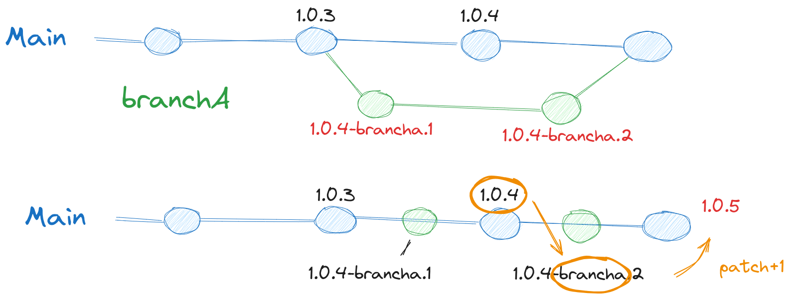
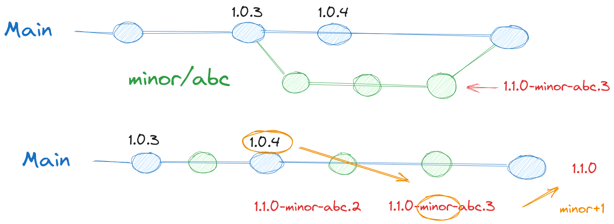
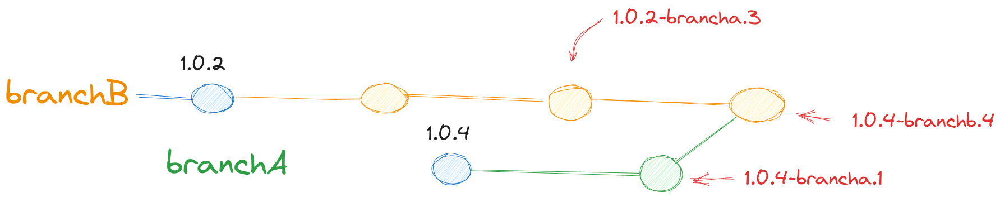

# Semver CLI

## Functional description

- Get last/highest tag (default 0.0.0)
- Determine new semver
- on main
  - get last/highest tag without suffix
  - calculate semver:
    - check suffix of intermediate tags
      - if `suffix=major/*`: major+1, minor=0, patch=0
      - if `suffix=minor/*`: minor+1, patch=0
    - else patch+1 (both other suffix or single commit)
- on non main branch
  - get last/highest tag without suffix
  - get branch name
  - calculate semver
  - get # commits since last/highest tag
  - new tag = new semver + branch name + #commits

See diagram for patch increase:

See diagram for minor (major is similar) increase:

- Merge main in branch:
  This should work. There is possibly a new lastTag/baseTag, prefix/branch stays the same, commit count may change.
- Merge branch in branch:
  Just recalculate branch name should do it

### Functions

- SemVer struc: add branchName string, commitNumber int
  (Of BranchSemVer) → Thijs
- AllTagsInBranch(repo, branch) []string → Christian
- ParseSemVer([]string) []semver → DONE
- HighestVersion([]semver) semver → Thijs
  - compare(v1, v2 semver) bool
    slice.sort([]semver, compare(i,j))
- (version *SemVer) IncreaseMajor() → Ton
  - (version *SemVer) IncreaseMinor()
  - (version *SemVer) IncreasePatch()
- GetBranchName(repo) string
- CountCommits(tag) int → Eric
- GenerateBranchTag(version semver, branchName string, )

