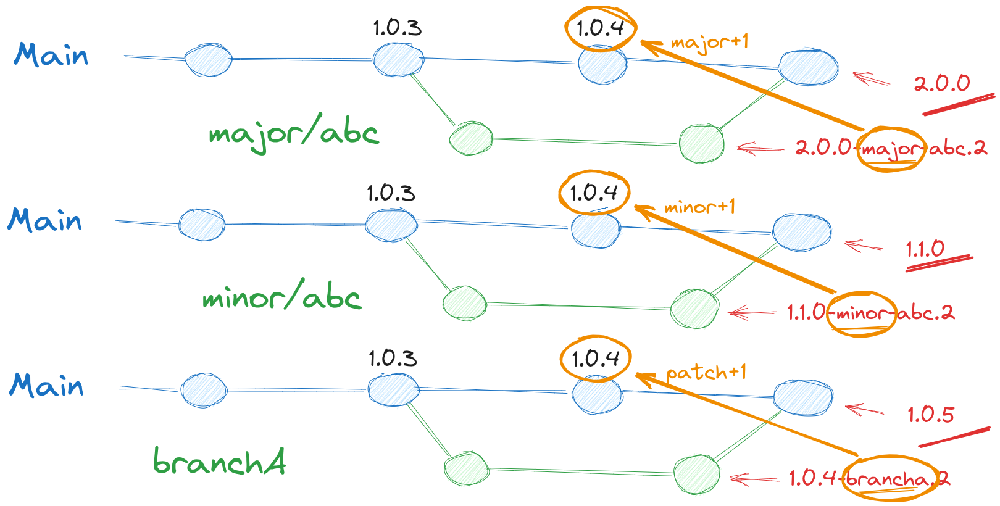

# Semver CLI

## Functional description

- Get last/highest tag (default 0.0.0)
- Determine new semver
- on main
  - get last/highest tag without suffix
  - calculate semver:
    - check suffix of intermediate tags
      - if `suffix=major/*`: major+1, minor=0, patch=0
      - if `suffix=minor/*`: minor+1, patch=0
    - else patch+1 (both other suffix or single commit)
- on non main branch
  - get last/highest tag without suffix
  - get branch name
  - calculate semver
  - get # commits since last/highest tag
  - new tag = new semver + branch name + #commits

See diagram 

- Merge main in branch:
  This should work. There is possibly a new lastTag/baseTag, prefix/branch stays the same, commit count may change.
- Merge branch in branch:
  Just recalculate branch name should do it

## Features

- Get highest/latest tag
  (without suffix)
- Get branch name
  - Check default branch
- Generate SemVer
- Set tag

### Functions

- GetLatestTag(repo) string
- StringToSemver(string) Semver
  - VerifySemver(string) bool
- GetBranchName(repo) string
- GetSemverIncrease(branchname string) string # one of major, minor, patch

### functions sketch

- getCurrentBranch(repo) string
- getDefaultBranch(repo) string
- getCurrentCommit(repo) commit
- getParrentCommitInMain(?) commit
- semverIncrement(branchname) semver
- getLatestSemverTag(commit) semver
- countCommitsSince(commit) int
- newTag(tag_current, tag_increment, currentBranch, commitCount) string
- setTag(tag_new)

## Structs

- Semver = (major int, minor int, patch int) # int or string?
  - add 4e element: (suffix string)?

